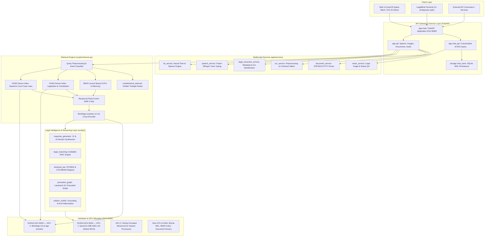

# LegalMindAI — System Architecture & Technical Design

## 1. System Overview

LegalMindAI is an enterprise-grade Indian Legal Research, Multimodal Assistant, and Legal Reasoning System engineered for statutory interpretation, constitutional analysis, case law retrieval, and legal document analysis.

---

## 2. Hardware Resource Allocation

The host environment is an 8-GPU **NVIDIA DGX B200** server. Resource allocation is strictly compartmentalized to prevent contention:

| Subsystem | Execution Target | Memory Footprint | Rationale |
|---|---|---|---|
| **Qwen3.6-35B-A3B Base LLM** | **GPU 1** (`cuda:1`) | ~38.4 GB VRAM | High-throughput generation in native `bfloat16` without quantization. |
| **BGE-M3 Dense Embeddings** | **GPU 4** (`cuda:4`) | ~4.2 GB VRAM | Rapid 1024-dim dense encoding of user queries and documents. |
| **BGE-Reranker-v2-m3** | **GPU 4** (`cuda:4`) | ~2.8 GB VRAM | High-precision cross-attention re-scoring of top-K candidate chunks. |
| **GPU 3 Guardrail** | **PROHIBITED** | 0 GB (Unused) | Strictly avoided due to existing processes on the DGX server. |
| **BM25 Lexical Indices** | **Host RAM (CPU)** | ~450 MB RAM | Ultra-fast token matching across 52,000+ indexed legal chunks. |
| **SQLite WAL Chat Storage** | **NVMe SSD (data/)** | In-process | ACID compliance, concurrent read/write isolation. |

---

## 3. Subsystem Architecture

### 3.1 Web UI & Chat Storage
- **Static Frontend**: Located in `app/static/` and `app/index.html`. Features an Apple macOS Space Black aesthetic with fluid iOS 18 glass refractions, Dynamic Island navigation, and zero layout collisions.
- **Persistence Layer**: `data/legalmind.db` operating in **SQLite WAL (Write-Ahead Logging)** mode. Provides user-level conversation isolation, FTS5 full-text message search, and atomic state transitions. Maintained without breaking changes to support parallel frontend development.

### 3.2 Multimodal Processing Layer (`app/services/`)
- **Document Analysis (`document_service.py`)**: Asynchronous multi-format document parser supporting PDF, DOCX, TXT, and scanned image extractions.
- **Legal Extraction (`legal_extraction_service.py`)**: Regex and heuristic extractor identifying statutory acts, sections, courts, case citations, and document types.
- **Vision QA (`vision_service.py`)**: Analyzes document layout, court seals, signatures, and stamps.
- **OCR Service (`ocr_service.py`)**: Features non-destructive optical character confusion correction (e.g. correcting `Sec. 3O2` to `Sec. 302`, `Artic1e` to `Article`).
- **Speech Services (`speech_service.py`, `tts_service.py`)**: Local voice typing transcription and neural speech output.

### 3.3 Hybrid RAG & Query Routing Layer (`scripts/retriever.py`)
- **Intent Detection**: Directs constitutional queries to the specialized Golden Triangle engine (`scripts/constitutional_retrieval.py`).
- **Dual-Index Search**: Simultaneously queries `vector_db/legislation/` (acts and constitution) and `vector_db/case_laws/` (Supreme Court judgments).
- **Reciprocal Rank Fusion (RRF)**: Merges dense vector results ($S_{\text{dense}}$) with BM25 lexical results ($S_{\text{bm25}}$) using constant $k=60$.
- **Cross-Encoder Re-Ranking**: Top-30 candidate chunks are re-scored using `BAAI/bge-reranker-v2-m3` on GPU 4.

### 3.4 Structured Legal Reasoning & Generation Engine
- **14-Section Synthesis (`scripts/response_generator.py`)**: Generates exhaustive legal responses structured into 14 ordered sections for constitutional and landmark inquiries.
- **12-Section Synthesis**: Generates structured responses tailored to statutory compliance inquiries.
- **Evidence-Grounded IRAC (`scripts/legal_reasoning.py`)**: Emits structured, auditable IRAC records while strictly suppressing raw model `<think>` tokens.
- **Temporal Statutory Engine (`scripts/temporal_law.py`)**: Maps historical statutes (IPC, CrPC, IEA) to modern replacements (BNS, BNSS, BSA) with automatic in-force flags and warnings.
- **Precedent Relationship Graph (`scripts/precedent_graph.py`)**: Models citations, overruled cases, distinguished decisions, and followed ratios.
- **Citation Verification (`app/services/citation_verifier.py`)**: Verifies all cited authorities against retrieved evidence chunks to protect against hallucinations.
