# LegalMindAI — Data Processing & Indexing Pipeline

This document explains the end-to-end data pipeline: ingestion, cleaning, legal chunking, dense embedding, FAISS indexing, and forensic validation.

---

## 1. Pipeline Workflow Overview

```mermaid
flowchart LR
    Raw["Raw Parquet / PDFs / Texts"] --> Ingest["01_ingest.py / Preprocessing"]
    Ingest --> Clean["Cleaned JSONL (data/processed/)"]
    Clean --> Chunk["02_chunk.py (Legal Boundary Chunking)"]
    Chunk --> ChunksJSONL["data/chunks/*/chunks.jsonl"]
    ChunksJSONL --> Embed["03_embed.py (BGE-M3 Dense Embedding on GPU 4)"]
    Embed --> EmbedNPY["embeddings/*/embeddings.npy (1024-d, L2 Norm)"]
    EmbedNPY --> FAISS["04_build_faiss.py / build_all_indexes.py"]
    FAISS --> VDB["vector_db/*/index.faiss + chunk_ids.json"]
    VDB --> Validate["validate_legal_corpus.py & validate_all_indexes.py"]
```



---

## 2. Ingestion & Preprocessing

### Legislation Preprocessing (`scripts/01b_preprocess_legislation.py`)
- Ingests raw parquet files from `data/raw/open-india-law/`.
- Extracts:
  - `act_name`: Standardized legal title (e.g. "Indian Penal Code, 1860").
  - `section_number`: Statutory section numbers.
  - `section_title`: Marginal notes or section titles.
  - `text`: Enacted statutory language.
- Cleans legal OCR noise, trailing hyphens, line breaks within sentences, and Gazette header artifacts.

### Case Law Preprocessing (`scripts/01c_preprocess_caselaws.py`)
- Extracts appellant, respondent, year, court, judge/bench size, official citation, and judgment body.
- Separates judicial ratio decidendi from arguments of counsel.

### Constitutional Provisions Ingestion (`scripts/ingest_constitution_articles.py`)
- Ingests the complete text of the Constitution of India.
- Splits Golden Triangle provisions (Articles 14, 19, 21, 32, 226) into sub-clause records so that clauses (e.g., Article 19(1)(a) freedom of speech vs Article 19(2) reasonable restrictions) are independently indexable.

---

## 3. Statutory Boundary Chunking (`scripts/02_chunk.py`)

Standard fixed-size text chunking (e.g., 500 characters) destroys legal meaning by slicing statutory sections in half. LegalMindAI uses **Statutory Boundary Chunking**:
1. **Section Integrity**: A statutory section is never broken across chunks if it fits within the max chunk window (~1,200 tokens).
2. **Sub-Clause Preservation**: Where an Act or Article contains multiple sub-clauses, boundaries occur at sub-clause delimiters `(1)`, `(2)`, `(a)`, `(b)`.
3. **Metadata Enrichment**: Each chunk retains:
   - `chunk_id`: Unique identifier (`leg_chunk_XXXXX`, `case_chunk_XXXXX`).
   - `document_id`: Standardized document slug.
   - `document_type`: `"act"`, `"constitution"`, or `"judgment"`.
   - `title`: Act or Case title.
   - `source`: File path or official citation.

---

## 4. Dense Vector Embedding (`scripts/03_embed.py`)

- **Embedding Model**: `BAAI/bge-m3` (multilingual, 1024-dimensional dense representation).
- **Execution Target**: **GPU 4** (`cuda:4`).
- **L2 Normalization**: Every output vector is normalized such that $\|\mathbf{v}\|_2 = 1.0$. Consequently, Inner Product (IP) search in FAISS is mathematically equivalent to Cosine Similarity.
- **Output Files**:
  - `embeddings.npy`: Binary numpy array of shape $(N, 1024)$.
  - `chunk_ids.json`: List mapping positional index to `chunk_id`.
  - `metadata.jsonl`: Full metadata matching vector positions.

---

## 5. FAISS Index Builder (`scripts/04_build_faiss.py` & `scripts/build_all_indexes.py`)

The builder automatically selects the optimal FAISS index architecture:
- **Small Datasets ($N < 10,000$)**: Uses `faiss.IndexFlatIP` (exact cosine search, zero quantization loss).
- **Large Datasets ($N \ge 10,000$)**: Uses `faiss.IndexIVFFlat` with $nlist = \max(64, \lfloor\sqrt{N}\rfloor)$.

All write operations use **atomic file movement** (`index.faiss.tmp` $\to$ `index.faiss`) to guarantee that active production queries never encounter partial or corrupted index files.

---

## 6. Corpus & Index Verification

Run periodic health audits to confirm zero corruptions:
```bash
# Verify chunks, core articles, core acts, and character counts
.venv/bin/python scripts/validate_legal_corpus.py

# Verify FAISS dimensions, vector counts, and live query sanity
.venv/bin/python scripts/validate_all_indexes.py
```
Both commands return exit code 0 when all validation criteria pass.
