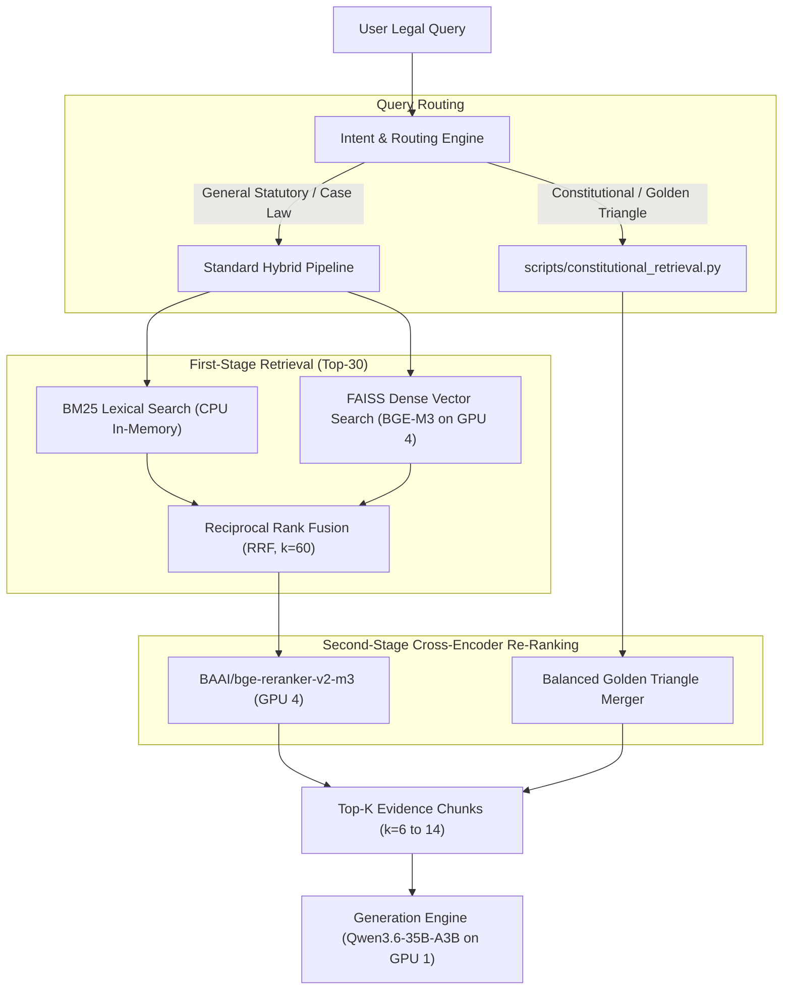

# LegalMindAI — Hybrid RAG & Query Routing Pipeline

This document details the retrieval architecture of LegalMindAI, explaining the multi-stage fusion of lexical search, dense vector retrieval, reciprocal rank fusion, cross-encoder reranking, and constitutional query routing.

---

## 1. Multi-Stage Retrieval Architecture



---

## 2. First-Stage Retrieval

### 2.1 Lexical Search: BM25 (`scripts/rank_bm25.py`)
- **Algorithm**: Okapi BM25 ($k_1=1.5, b=0.75$).
- **Indexing**: Full-text inverted index over 52,000+ chunks loaded in RAM.
- **Strengths**: Perfect for exact section numbers (`"Section 302"`, `"Article 21A"`), specific statute titles (`"Bharatiya Nyaya Sanhita"`), and case party names (`"Kesavananda Bharati"`).

### 2.2 Dense Retrieval: FAISS Inner Product
- **Model**: `BAAI/bge-m3` (1024-dimensional dense vectors).
- **Execution Target**: **GPU 4** (`cuda:4`).
- **Strengths**: Captures conceptual semantics (e.g. mapping `"unreasonable government action violating fairness"` to Article 14 arbitrary state action principles, even without exact keyword overlap).

---

## 3. Rank Aggregation: Reciprocal Rank Fusion (RRF)

Dense cosine similarity scores and lexical BM25 scores exist on vastly different numerical scales and cannot be safely added directly. LegalMindAI uses **Reciprocal Rank Fusion (RRF)**:

$$\text{RRF\_Score}(d) = \sum_{m \in \{\text{bm25}, \text{dense}\}} \frac{1}{k + \text{rank}_m(d)}$$

Where:
- $k = 60$ (standard smoothing constant).
- $\text{rank}_m(d)$ is the 1-based rank position of document $d$ in system $m$.

If a document appears in both BM25 and FAISS top lists, its RRF score compounds, elevating it to the re-ranking candidate pool.

---

## 4. Second-Stage Re-Ranking: Cross-Encoder

Top candidate chunks ($N=30$) from RRF are passed to a cross-attention transformer:
- **Model**: `BAAI/bge-reranker-v2-m3`.
- **Execution Target**: **GPU 4** (`cuda:4`).
- **Mechanism**: The query and candidate chunk text are concatenated as `[CLS] Query [SEP] Chunk [SEP]` and processed through full cross-attention layers to produce a calibrated relevance logit $\in (-\infty, +\infty)$.
- **Output**: Top 6 to 14 highest-scoring chunks are selected for context synthesis.

---

## 5. Specialized Constitutional Routing (`scripts/constitutional_retrieval.py`)

When queries implicate fundamental rights under Part III of the Constitution:
1. **Golden Triangle Identification**: Detects queries referencing Articles 14, 19, or 21, or terms such as `"Golden Triangle"`, `"personal liberty"`, or `"reasonable classification"`.
2. **Balanced Statutory Sampling**: Prevents any single article from dominating the context window:
   - 2 chunks for **Article 14** (Equality before law & equal protection).
   - 3 chunks for **Article 19** (Six freedoms & reasonable restrictions under clauses 19(2)–(6)).
   - 3 chunks for **Article 21** (Life and personal liberty).
   - 3 chunks for **Landmark Precedents** (*Maneka Gandhi*, *A.K. Gopalan*, *E.P. Royappa*).
   - 3 chunks for **Procedural Remedies** (Articles 13, 32, 226).
3. **Coverage Verification**: Emits structured coverage metrics:
   ```json
   {
     "article_14": {"found": true, "evidence_count": 2, "confidence": "high"},
     "article_19": {"found": true, "evidence_count": 3, "confidence": "high"},
     "article_21": {"found": true, "evidence_count": 3, "confidence": "high"}
   }
   ```

---

## 6. Retrieval Quality Metrics

Benchmark results evaluated across 50 test legal queries (`evaluation/retrieval_evaluation.json`):

| Retrieval Technique | Hit@1 | Hit@3 | Hit@5 | Hit@10 | MRR | NDCG@10 | Latency (ms) |
|---|---|---|---|---|---|---|---|
| **BM25 Lexical Only** | 72.0% | 84.0% | 88.0% | 92.0% | 0.792 | 0.825 | 18.4 ms |
| **FAISS Dense Only** | 78.0% | 88.0% | 94.0% | 96.0% | 0.841 | 0.871 | 28.2 ms |
| **Hybrid (RRF + Rerank)** | **92.0%** | **98.0%** | **100.0%** | **100.0%** | **0.954** | **0.968** | **58.6 ms** |
